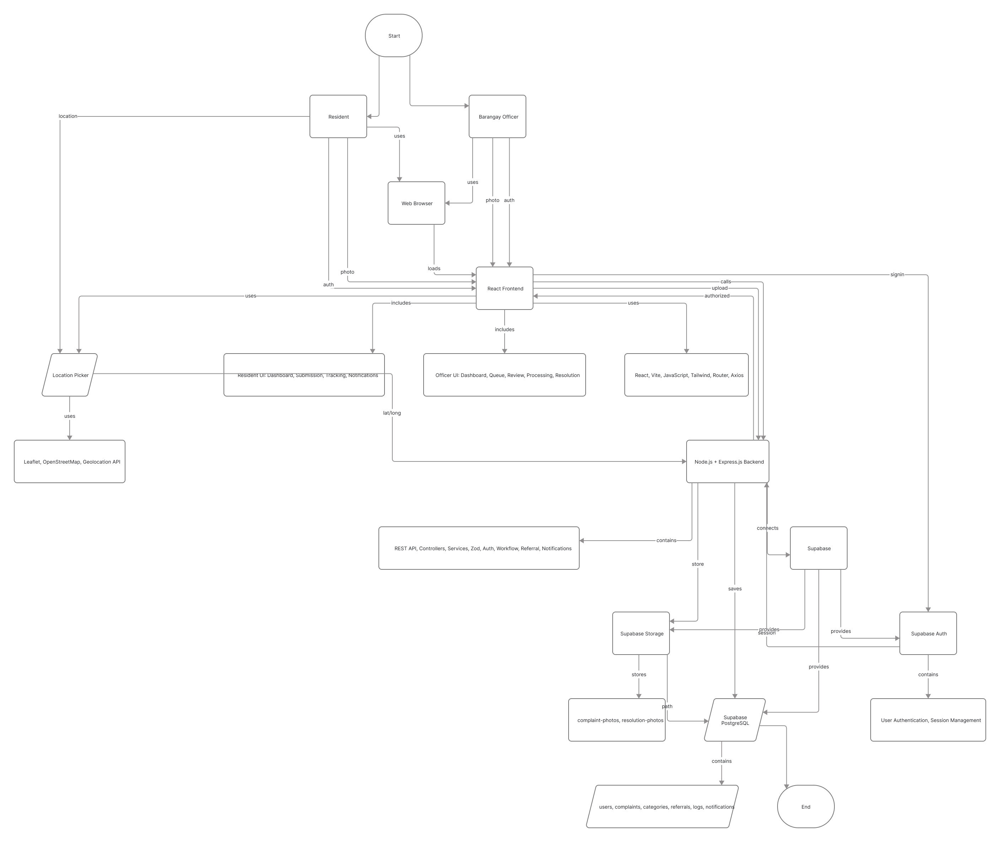
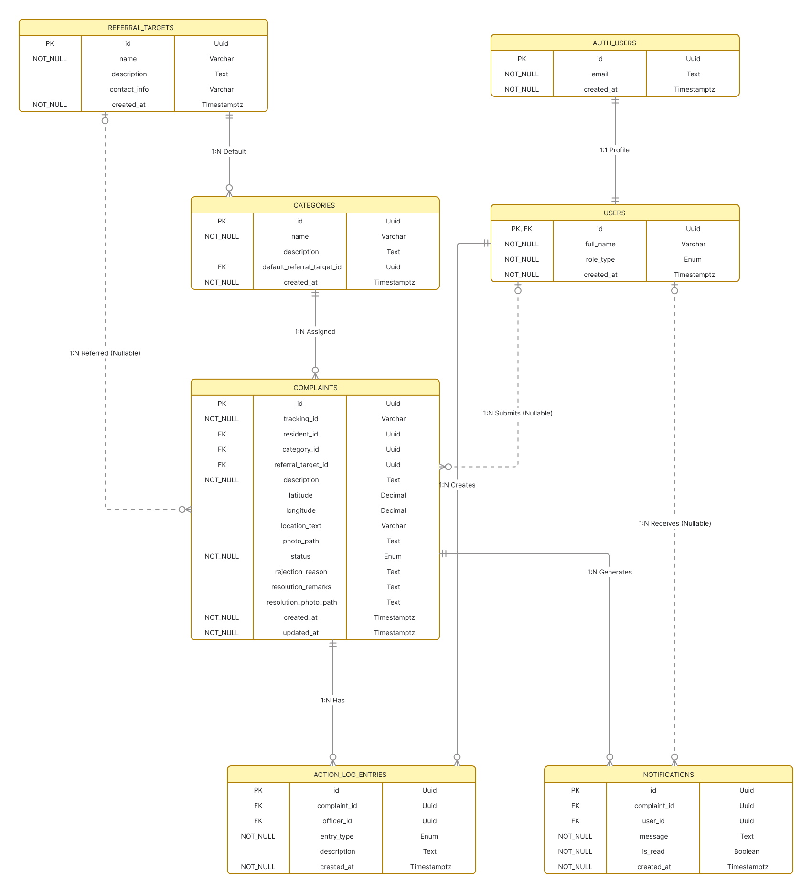
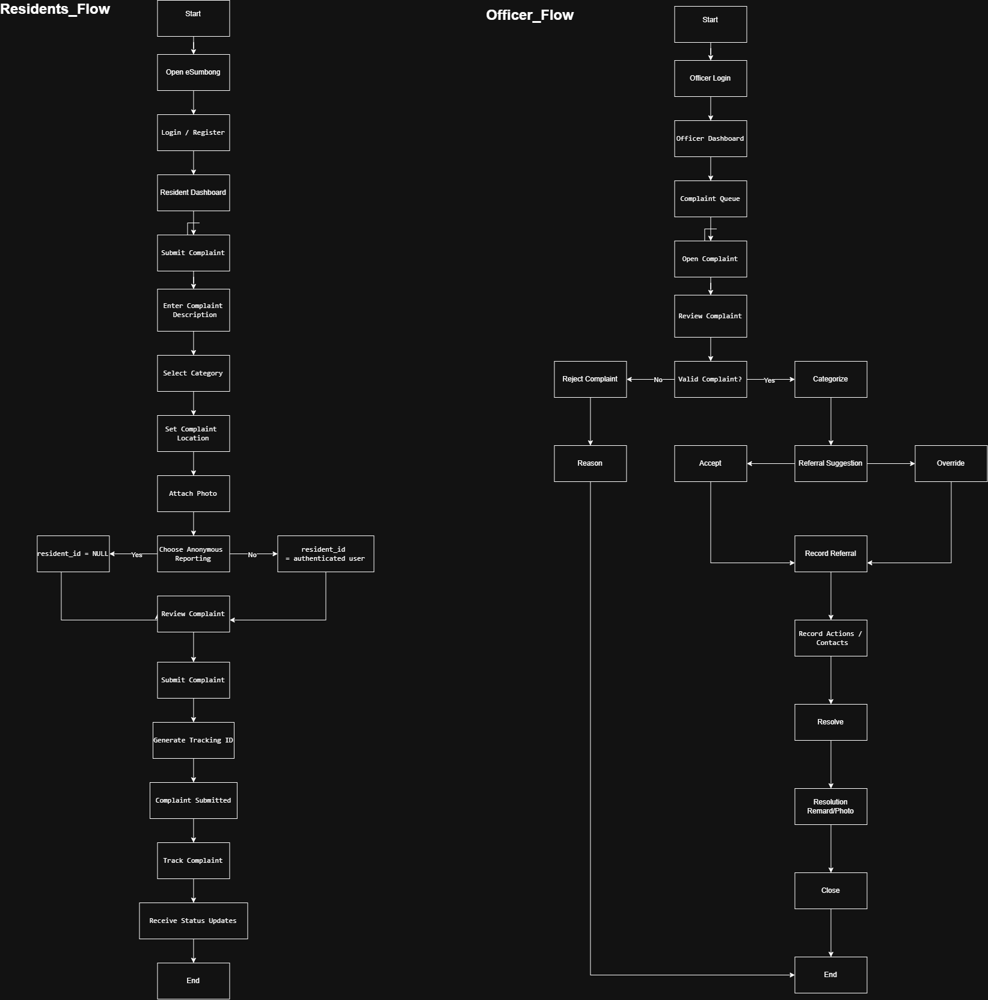
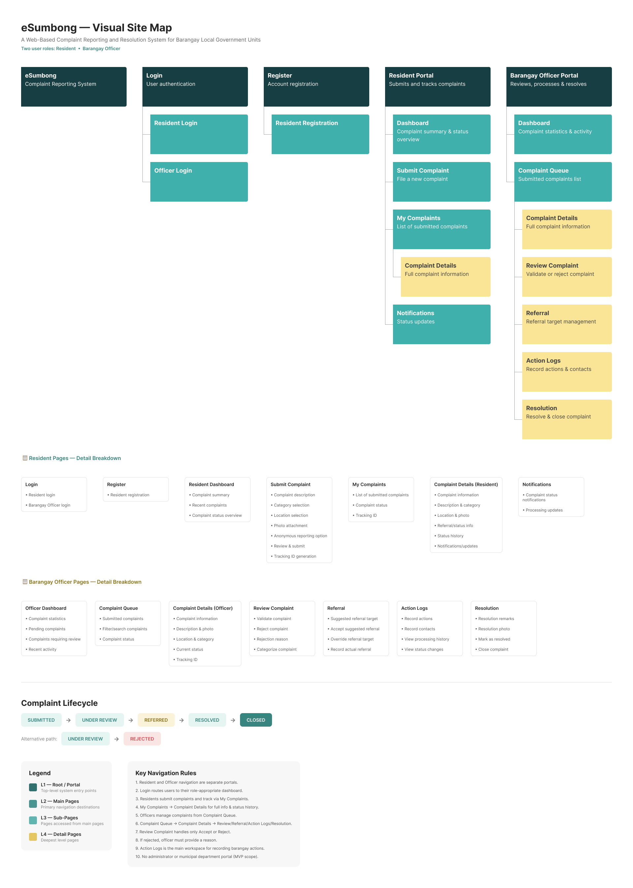

# eSumbong

### A Web-Based Complaint Reporting and Resolution System for Barangay Local Government Units

eSumbong is a web-based complaint reporting and resolution system designed to help residents submit community complaints and allow Barangay Officers to review, process, refer, resolve, and close those complaints in a structured manner.

---

## Project Scope

The current pilot MVP consists of two primary user roles:

- **Resident** — submits and tracks complaints.
- **Barangay Officer** — reviews, categorizes, refers, processes, resolves, and closes complaints.

---

## Core Features

### Resident

- Account registration and login
- Complaint submission
- Complaint description and category
- Photo attachment
- Complaint location selection
- Anonymous reporting
- Complaint tracking
- Status notifications

### Barangay Officer

- Complaint queue
- Complaint review and validation
- Complaint rejection with reason
- Complaint categorization
- Referral suggestion review
- Referral acceptance or override
- Action and contact logging
- Resolution remarks and photos
- Complaint closure

---

## Complaint Workflow

```text
SUBMITTED
    ↓
UNDER REVIEW
    ↓
REFERRED
    ↓
RESOLVED
    ↓
CLOSED
```

Invalid complaints may follow:

```text
UNDER REVIEW
    ↓
REJECTED
```

---

## Referral Mechanism

eSumbong uses a rule-based referral suggestion mechanism.

A complaint category may have a default referral target. When an officer reviews a complaint, the system provides the suggested target. The Barangay Officer may:

1. Accept the suggested referral target, or
2. Override it with another appropriate referral target.

The system does **not** automatically route complaints to external offices.

---

## System Architecture



The system uses a React frontend, an Express.js REST API backend, and Supabase services for authentication, file storage, and PostgreSQL database management.

---

## Database / ERD



The database includes the following core entities:

- users
- complaints
- categories
- referral_targets
- action_log_entries
- notifications

Supabase Auth manages authentication users separately through `auth.users`.

---

## User Flow



The user flow covers both Resident and Barangay Officer processes.

---

## Sitemap



The sitemap defines the main navigation and page structure for both user roles.

---

## Technology Stack

### Frontend

- React.js
- Vite
- JavaScript
- Tailwind CSS
- React Router
- Axios

### Backend

- Node.js
- Express.js
- REST API
- Zod

### Backend Services

- Supabase Auth
- Supabase PostgreSQL
- Supabase Storage

### Location

- Leaflet
- OpenStreetMap

### Version Control

- Git
- GitHub

---

## Project

**eSumbong**  
Western Institute of Technology  
Bachelor of Science in Information Technology

Developed as an academic software project.
