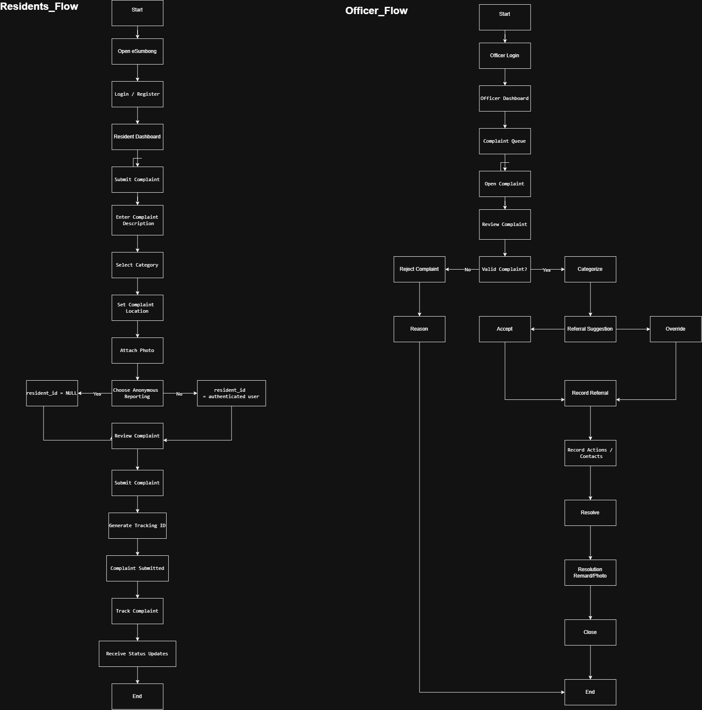

# eSumbong

### A Web-Based Complaint Reporting and Resolution System for Barangay Local Government Units

eSumbong is a web-based complaint reporting and resolution system designed to help residents submit community complaints and allow Barangay Officers to review, process, refer, resolve, and close complaints in a structured manner.

Developed as a Bachelor of Science in Information Technology software project at **Western Institute of Technology**.

---

## Table of Contents

- [Project Scope](#project-scope)
- [Core Features](#core-features)
- [Complaint Workflow](#complaint-workflow)
- [Referral Mechanism](#referral-mechanism)
- [System Architecture](#system-architecture)
- [Database / ERD](#database--erd)
- [User Flow](#user-flow)
- [Sitemap](#sitemap)
- [Technology Stack](#technology-stack)
- [Project Status](#project-status)
- [Development Approach](#development-approach)
- [Getting Started](#getting-started)
- [Guest Access](#guest-access)
- [Officer Access](#officer-access)
- [Project Information](#project-information)

---

## Project Scope

The current pilot MVP consists of two primary user roles:

### Resident

Residents can submit community complaints, provide relevant details and evidence, and track the progress of their complaints.

### Barangay Officer

Barangay Officers can review, validate, categorize, refer, process, resolve, and close submitted complaints.

The current MVP does **not** include:

- Administrator accounts
- Municipal Officer accounts
- Department Officer accounts
- Automatic complaint routing
- Automatic referral to external offices

---

## Core Features

### Resident

- Account registration and login
- Complaint submission
- Complaint description and categorization
- Photo attachment
- Complaint location selection using a map
- Anonymous reporting
- Guest complaint submission without an account
- Complaint tracking using a Tracking ID
- Status notifications

### Barangay Officer

- Complaint queue
- Complaint review and validation
- Complaint rejection with reason
- Complaint categorization
- Referral suggestion review
- Referral acceptance or override
- Action and contact logging
- Resolution remarks
- Resolution photo attachment
- Complaint closure

---

## Complaint Workflow

The standard complaint lifecycle follows this process:

```text
SUBMITTED
    ↓
UNDER REVIEW
    ↓
REFERRED
    ↓
RESOLVED
    ↓
CLOSED
```

Invalid complaints may follow:

```text
UNDER REVIEW
    ↓
REJECTED
```

### Workflow Description

1. **Submitted** — A resident submits a complaint through the system.
2. **Under Review** — A Barangay Officer reviews and validates the complaint.
3. **Referred** — The complaint is referred to an appropriate target when necessary.
4. **Resolved** — The complaint has been addressed and resolution details are recorded.
5. **Closed** — The complaint process is completed and the case is formally closed.
6. **Rejected** — A complaint may be rejected when it is determined to be invalid or inappropriate, with a reason recorded by the officer.

---

## Referral Mechanism

eSumbong uses a **rule-based referral suggestion mechanism**.

Each complaint category may have a default referral target. When a Barangay Officer reviews a complaint, the system provides the corresponding suggested referral target.

The Barangay Officer can:

- **Accept** the suggested referral target
- **Override** the suggestion with another appropriate referral target

The system does **not** automatically route complaints to external offices. The final referral decision remains with the Barangay Officer.

---

## System Architecture


The system uses a layered web architecture consisting of:

- **React.js** frontend
- **Express.js** REST API backend
- **Supabase Auth** for authentication
- **Supabase PostgreSQL** for database management
- **Supabase Storage** for file storage

The frontend communicates with the Express.js backend through REST API endpoints, while the backend interacts with Supabase services for authentication, database operations, and file storage.

---

## Database / ERD


The database contains the following core entities:

| Entity               | Description                                                                   |
| -------------------- | ----------------------------------------------------------------------------- |
| `users`              | Stores application-level user information for Residents and Barangay Officers |
| `complaints`         | Stores the central complaint records                                          |
| `categories`         | Defines complaint categories and their default referral targets               |
| `referral_targets`   | Stores appropriate offices or entities that may receive referrals             |
| `action_log_entries` | Records complaint status changes, actions, and contact logs                   |
| `notifications`      | Stores notifications for residents regarding complaint updates                |

Authentication is handled separately through **Supabase Auth**, which manages authentication users through `auth.users`.

---

## User Flow



The user flow covers the major processes of both Residents and Barangay Officers.

### Resident Flow

```text
Landing Page
    ↓
Register / Login
    ↓
Resident Dashboard
    ↓
Submit Complaint
    ↓
Track Complaint
    ↓
Receive Status Updates
```

Residents may also submit a complaint without registering through the guest submission process.

### Barangay Officer Flow

```text
Officer Login
    ↓
Officer Dashboard
    ↓
Review Complaint
    ↓
Validate / Reject
    ↓
Categorize Complaint
    ↓
Review Referral Suggestion
    ↓
Accept / Override Referral
    ↓
Record Actions
    ↓
Resolve Complaint
    ↓
Close Complaint
```

---

## Sitemap


The sitemap defines the main navigation structure of the application.

### Public Pages

- Landing Page
- Login
- Register
- Track Complaint
- Guest Complaint Submission

### Resident Portal

- Resident Dashboard
- Submit Complaint
- My Complaints
- Complaint Details
- Notifications
- Profile

### Officer Portal

- Officer Login
- Officer Dashboard
- Complaint Queue
- Complaint Details
- Complaint Review
- Referral Management
- Action Logs
- Resolution Management

---

## Technology Stack

### Frontend

- React.js
- Vite
- JavaScript
- Tailwind CSS
- React Router
- Axios

### Backend

- Node.js
- Express.js
- REST API
- Zod

### Backend Services

- Supabase Auth
- Supabase PostgreSQL
- Supabase Storage

### Location Services

- Leaflet
- OpenStreetMap
- Browser Geolocation API

### Testing

- Jest
- Supertest
- React Testing Library

### Version Control

- Git
- GitHub

---

## Project Status

**Current Phase: Phase 2 — Define**

Current Phase 2 deliverables include:

- [x] Product Requirements Document
- [x] System Architecture Diagram
- [x] Database / ERD Diagram
- [x] User Flow
- [x] Sitemap
- [x] GitHub Repository
- [x] Project Board

---

## Development Approach

The project follows an **Agile Scrum** development approach.

Development activities include:

1. Requirements analysis
2. Product and feature definition
3. UI/UX design
4. System architecture and database design
5. Frontend development
6. Backend API development
7. Database integration
8. Testing
9. Evaluation and refinement

The system is developed iteratively, allowing requirements and implementation details to be refined throughout the development process.

---

## Getting Started

### Prerequisites

Make sure the following are installed:

- [Node.js](https://nodejs.org/) v18 or higher
- npm or yarn
- A [Supabase](https://supabase.com/) account

### 1. Clone the Repository

```bash
git clone https://github.com/bitguybandit/eSumbong.git
cd eSumbong
```

### 2. Set Up the Backend

Navigate to the server directory:

```bash
cd server
npm install
```

Copy the environment configuration file:

```bash
cp .env.example .env
```

Configure the required Supabase credentials inside `.env`.

### 3. Set Up the Database

Open the **Supabase SQL Editor** and run the SQL schema files located in:

```text
server/sql/
```

At minimum, run the database schema required by the project before starting the application.

### 4. Set Up the Frontend

From the project root, navigate to the client directory:

```bash
cd ../client
npm install
```

Copy the environment configuration file:

```bash
cp .env.example .env
```

Configure the required environment variables.

### 5. Run the Development Servers

Start the backend:

```bash
cd server
npm run dev
```

In a second terminal, start the frontend:

```bash
cd client
npm run dev
```

The frontend will normally be available at:

```text
http://localhost:5173
```

---

## Guest Access

Residents can submit complaints without creating an account through the **"Continue Without Registering"** option.

Guest users can:

- Submit a complaint
- Provide complaint details
- Attach supporting evidence
- Provide a complaint location
- Receive a Tracking ID
- Track their complaint using the Tracking ID

Anonymous complaints do not require a resident account.

---

## Officer Access

Barangay Officer accounts are **pre-provisioned manually** through the Supabase Dashboard.

There is no public officer registration.

The officer login is available through the dedicated route:

```text
/officer/login
```

The officer login route is not linked from the public resident-facing navigation.

---

## Project Information

**Project:** eSumbong  
**Institution:** Western Institute of Technology  
**Program:** Bachelor of Science in Information Technology  
**Project Type:** Academic Software Project

eSumbong is developed as an academic software project focused on improving the reporting and resolution workflow of community complaints at the barangay level.

---

## License

This project is developed for academic purposes as part of the Bachelor of Science in Information Technology program at Western Institute of Technology.
