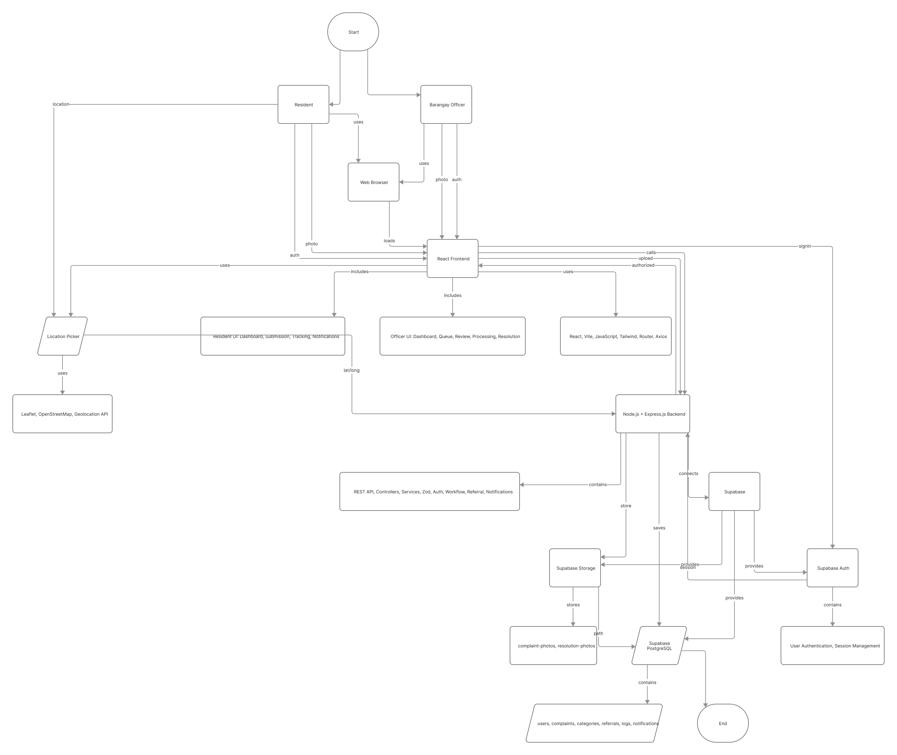
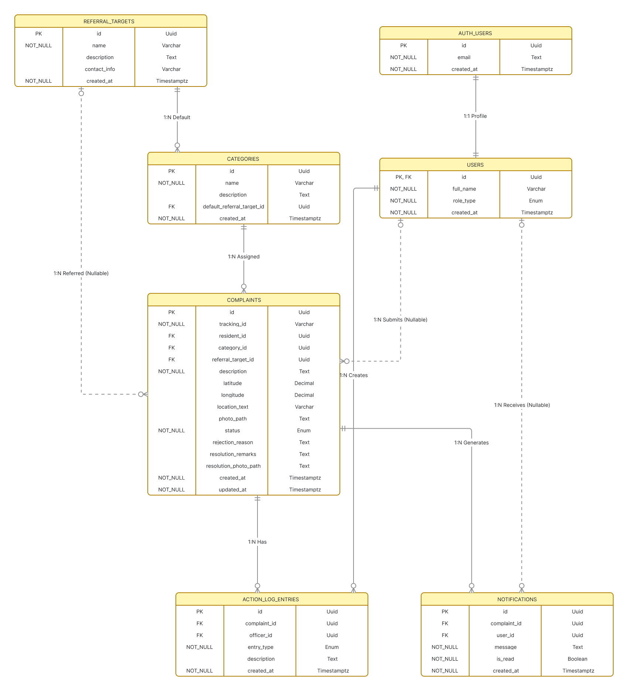
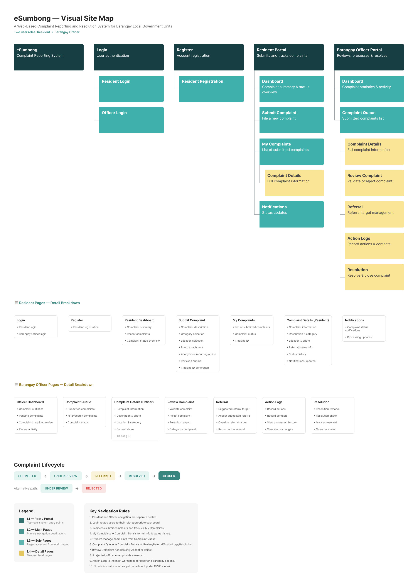

# eSumbong

### A Web-Based Complaint Reporting and Resolution System for Barangay Local Government Units

eSumbong is a web-based complaint reporting and resolution system designed to help residents submit community complaints and allow Barangay Officers to review, process, refer, resolve, and close those complaints in a structured manner.

---

## Project Scope

The current pilot MVP consists of two primary user roles:

- **Resident** — submits and tracks complaints.
- **Barangay Officer** — reviews, categorizes, refers, processes, resolves, and closes complaints.

> There is no administrator or municipal-department portal in the MVP scope.

---

## Core Features

### Resident

- Account registration and login
- Complaint submission
- Complaint description and category
- Photo attachment
- Complaint location selection (Leaflet + OpenStreetMap)
- Anonymous reporting
- Complaint tracking (My Complaints + tracking ID)
- Status notifications

### Barangay Officer

- Complaint queue
- Complaint review and validation
- Complaint rejection with reason
- Complaint categorization
- Referral suggestion review
- Referral acceptance or override
- Action and contact logging
- Resolution remarks and photos
- Complaint closure

---

## Complaint Workflow

```text
SUBMITTED
    ↓
UNDER REVIEW        (shown in the UI as "Accepted" for barangay action)
    ↓
REFERRED            (shown in the UI as "In Progress" while actions are logged)
    ↓
RESOLVED
    ↓
CLOSED
```

Invalid complaints may follow:

```text
UNDER REVIEW
    ↓
REJECTED
```

---

## Referral Mechanism

eSumbong uses a **rule-based referral suggestion mechanism**.

A complaint category may have a `default_referral_target_id`. When an officer reviews a complaint, the system provides the suggested target. The Barangay Officer may:

1. Accept the suggested referral target, or
2. Override it with another appropriate referral target.

The system does **not** automatically route complaints to external offices.

---

## System Architecture



The system uses a React frontend, an Express.js REST API backend, and Supabase services for authentication, file storage, and PostgreSQL database management.

```
┌────────────────────┐       REST/JSON (Bearer token)       ┌────────────────────┐
│  React + Vite SPA  │ ───────────────────────────────────▶ │  Express.js API    │
│  (Tailwind, Leaflet)│ ◀─────────────────────────────────── │  (Zod validation)  │
└─────────┬──────────┘                                      └─────────┬──────────┘
          │ Supabase Auth (sign-up/sign-in/session)                    │ Service-role key
          ▼                                                            ▼
┌───────────────────────────────────────────────────────────────────────────────┐
│  Supabase  (Auth · PostgreSQL · Storage)                                      │
└───────────────────────────────────────────────────────────────────────────────┘
```

---

## Database / ERD



The database includes the following core entities:

- `users`
- `complaints`
- `categories`
- `referral_targets`
- `action_log_entries`
- `notifications`

Supabase Auth manages authentication users separately through `auth.users`. A database trigger (`on_auth_user_created`) mirrors each `auth.users` row into the public `users` profile table.

Full DDL and seed data: [`server/sql/schema.sql`](server/sql/schema.sql)

---

## User Flow


The user flow covers both Resident and Barangay Officer processes.

---

## Sitemap



### Routes

| Route                      | Role     | Page                                           |
| -------------------------- | -------- | ---------------------------------------------- |
| `/`                        | Public   | Landing / portal chooser                       |
| `/login`                   | Public   | Login (resident & officer)                     |
| `/register`                | Public   | Resident registration                          |
| `/resident`                | Resident | Resident dashboard                             |
| `/resident/submit`         | Resident | Submit complaint                               |
| `/resident/complaints`     | Resident | My complaints                                  |
| `/resident/complaints/:id` | Resident | Complaint details                              |
| `/resident/notifications`  | Resident | Notifications                                  |
| `/officer`                 | Officer  | Officer dashboard                              |
| `/officer/queue`           | Officer  | Complaint queue                                |
| `/officer/action-log`      | Officer  | Action log                                     |
| `/officer/complaints/:id`  | Officer  | Complaint details (review/refer/resolve/close) |
| `/officer/settings`        | Officer  | Settings                                       |

---

## Technology Stack

### Frontend

- React.js
- Vite
- JavaScript
- Tailwind CSS
- React Router
- Axios
- Supabase JS (client auth + session)

### Backend

- Node.js
- Express.js
- REST API
- Zod
- Supabase JS (service role)

### Backend Services

- Supabase Auth
- Supabase PostgreSQL
- Supabase Storage

### Location

- Leaflet
- OpenStreetMap (tiles + Nominatim reverse geocoding)

### Version Control

- Git
- GitHub

---

## Project Structure

```text
eSumbong/
├── client/                     # React + Vite frontend
│   ├── src/
│   │   ├── components/         # Shared UI (sidebar, modals, map, badges…)
│   │   ├── context/            # AuthContext
│   │   ├── lib/                # supabase client + axios api
│   │   └── pages/
│   │       ├── resident/
│   │       └── officer/
│   └── package.json
├── server/                     # Express + Zod backend
│   ├── src/
│   │   ├── middleware/
│   │   ├── routes/
│   │   ├── schemas/
│   │   └── utils/
│   ├── sql/schema.sql          # DDL + triggers + seed data
│   └── package.json
└── docs/                       # architecture, ERD, user-flow, sitemap images
```

---

## Getting Started

### 1. Supabase setup

1. Create a project at [supabase.com](https://supabase.com).
2. In **SQL Editor**, run the entire [`server/sql/schema.sql`](server/sql/schema.sql). This creates tables, enums, indexes, triggers, and seed data (categories + referral targets).
3. In **Storage**, create two **public** buckets:
   - `complaint-photos`
   - `resolution-photos`
4. Copy the project **URL**, **anon key**, and **service role key** from **Settings → API**.

### 2. Backend

```bash
cd server
cp .env.example .env        # fill in Supabase values
npm install
npm run dev                 # starts on http://localhost:4000
```

### 3. Frontend

```bash
cd client
cp .env.example .env        # fill in Supabase URL + anon key, API URL
npm install
npm run dev                 # starts on http://localhost:5173
```

### 4. Create an officer account

Register a resident account through the UI (or any auth user), then promote it:

```sql
update public.users u
set role_type = 'officer'
from auth.users a
where u.id = a.id and a.email = 'officer@example.com';
```

> Or insert an auth user via Supabase dashboard and update `role_type`. The profile row is auto-created by the `on_auth_user_created` trigger.

---

## Environment Variables

### `server/.env`

```env
PORT=4000
SUPABASE_URL=https://xxxx.supabase.co
SUPABASE_SERVICE_ROLE_KEY=eyJ...
CLIENT_URL=http://localhost:5173
```

### `client/.env`

```env
VITE_SUPABASE_URL=https://xxxx.supabase.co
VITE_SUPABASE_ANON_KEY=eyJ...
VITE_API_URL=http://localhost:4000/api
```

---

## API Overview

| Method | Endpoint                                 | Description                             |
| ------ | ---------------------------------------- | --------------------------------------- |
| GET    | `/api/auth/me`                           | Current user + profile                  |
| GET    | `/api/categories`                        | Categories with default referral target |
| GET    | `/api/referral-targets`                  | Referral targets                        |
| POST   | `/api/uploads`                           | Upload photo to storage                 |
| POST   | `/api/complaints`                        | Submit complaint (resident/anonymous)   |
| GET    | `/api/complaints/mine`                   | Resident's complaints                   |
| GET    | `/api/complaints/:id`                    | Complaint detail (role-aware)           |
| GET    | `/api/notifications`                     | Current user's notifications            |
| PATCH  | `/api/notifications/:id/read`            | Mark notification read                  |
| GET    | `/api/officer/dashboard`                 | Officer dashboard stats                 |
| GET    | `/api/officer/complaints`                | Complaint queue (`status=submitted`)    |
| GET    | `/api/officer/action-log`                | Accepted/processing complaints          |
| POST   | `/api/officer/complaints/:id/accept`     | Accept complaint                        |
| POST   | `/api/officer/complaints/:id/reject`     | Reject complaint                        |
| POST   | `/api/officer/complaints/:id/categorize` | Set category + referral                 |
| POST   | `/api/officer/complaints/:id/actions`    | Log an action/contact                   |
| POST   | `/api/officer/complaints/:id/resolve`    | Add resolution remarks/photo            |
| POST   | `/api/officer/complaints/:id/close`      | Close complaint                         |

---

## Project

**eSumbong**
Western Institute of Technology
Bachelor of Science in Information Technology

Developed as an academic software project.
